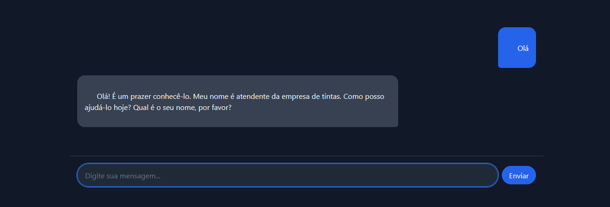
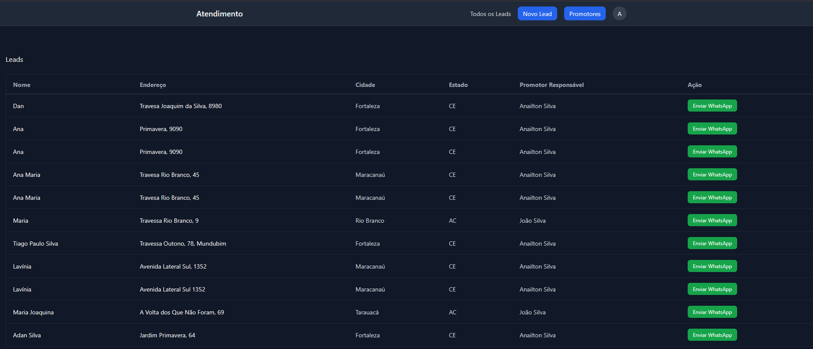
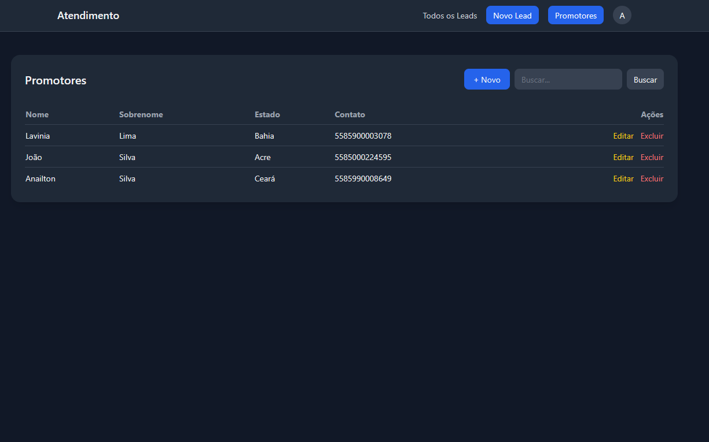
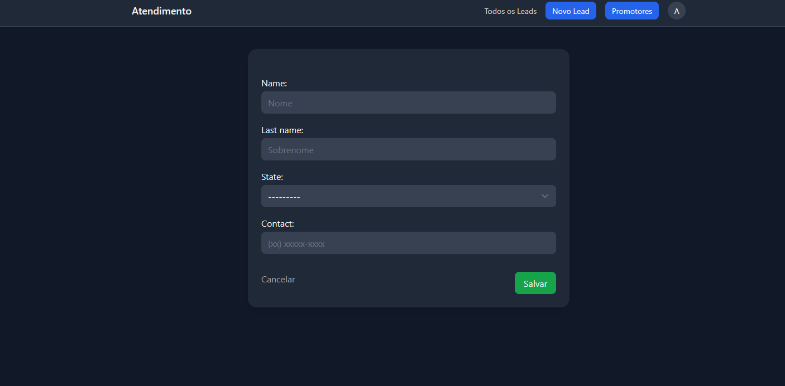

# 🎨 LeadBridge

Sistema web de captação e gestão de leads para revendedores, desenvolvido para uma empresa que busca melhorar seus atendimentos. Automatiza o atendimento via chat com IA, coleta dados do interessado e encaminha para o representante comercial responsável pela região.

---

## 💡 Problema que resolve

A empresa recebia contatos de pessoas interessadas em revender seus produtos, e todo o atendimento era feito manualmente por uma atendente via WhatsApp. O LeadBridge automatiza esse fluxo: um chat com IA conduz a conversa, coleta os dados do prospect e gera um link direto para o representante comercial pela região.

---

## 🔄 Fluxo do sistema

1. Cliente acessa a página de chat e inicia uma conversa
2. A IA conduz o atendimento e coleta: nome, cidade, estado, telefone e endereço
3. O sistema identifica o promotor de vendas responsável pelo estado informado
4. O lead é salvo no banco de dados
5. No painel interno, a atendente visualiza o lead e clica em **Enviar WhatsApp** — abrindo uma conversa já formatada com o promotor

---

## 🖼️ Screenshots

### Chat com IA
> 

### Painel interno de leads
> 

### Painel de promotores
> 

### Cadastro de promotores
> 


---

## 🛠️ Stack

| Camada | Tecnologia |
|---|---|
| Backend | Django (CBVs, ORM, migrações com RunPython) |
| IA | Groq API — modelo `llama-3.3-70b-versatile` |
| Frontend | HTMX + Bootstrap |
| Comunicação | Links `wa.me` (WhatsApp sem API oficial) |

---

## ⚙️ Como rodar localmente

### Pré-requisitos

- Python 3.11+
- Conta na [Groq](https://console.groq.com) para obter a API key gratuita

### Instalação

```bash
# Clone o repositório
git clone https://github.com/Anailton10/leadbridge.git
cd leadbridge

# Crie e ative o ambiente virtual
python -m venv venv
source venv/bin/activate  # Windows: venv\Scripts\activate

# Instale as dependências
pip install -r requirements.txt
```

### Variáveis de ambiente

Crie um arquivo `.env` na raiz do projeto:

```env
SECRET_KEY=sua_secret_key_django
DEBUG=True
GROQ_API_KEY=sua_chave_groq
```

### Banco de dados

```bash
python manage.py migrate
python manage.py createsuperuser
```

### Rodar o servidor

```bash
python manage.py runserver
```

Acesse em `http://localhost:8000`

---

## 📁 Estrutura dos apps

```
├── chat/          # Chat com IA — view, serviço de integração com Groq
├── promoter/      # Cadastro de estados e promotores (CRUD)
├── leads/         # Modelo de leads e painel interno
```

---

## ✨ Funcionalidades

- Chat com IA que conduz o atendimento de forma natural
- Coleta estruturada de dados via JSON
- Validação de telefone antes de salvar o lead
- Roteamento automático para o promotor pelo estado
- Painel interno com listagem de leads e link direto pro WhatsApp
- CRUD completo de promotores
- Autenticação para acesso ao painel interno
- Histórico de conversa mantido por sessão

---

## 👤 Autor

**Anailton Silva** — [@Anailton10](https://github.com/Anailton10)